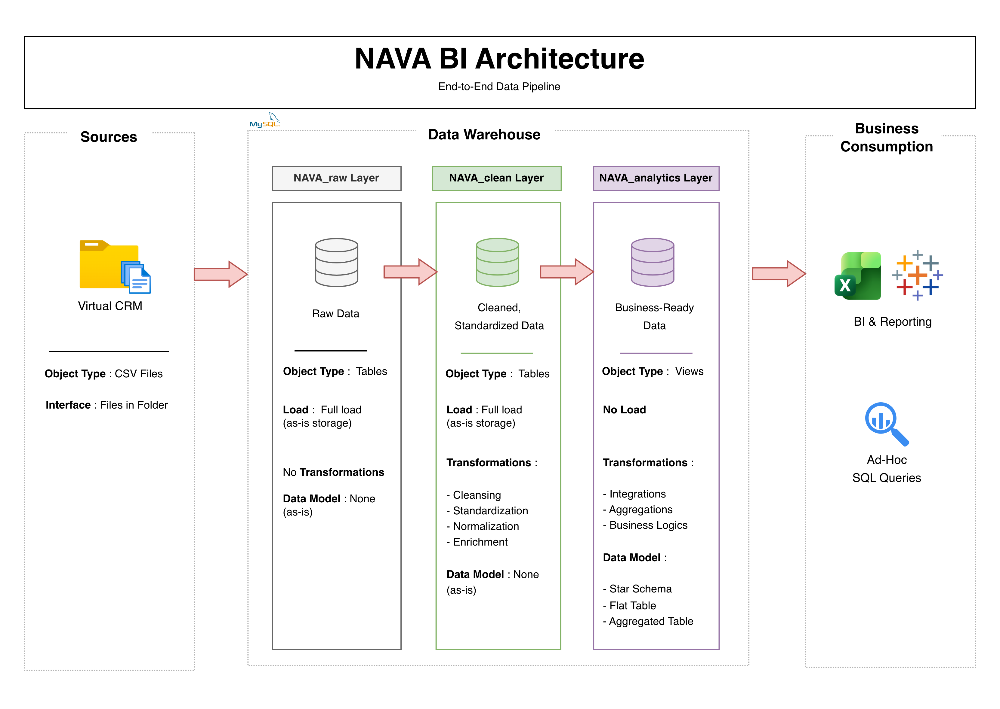

# 00 Technical Foundation

### Shared SQL Architecture

This repository contains the shared SQL architecture powering the entire [**NAVA Business Intelligence Portfolio**](https://github.com/ammflo-ops/NAVA-Business-Intelligence-Portfolio/blob/main/README.md).

It provides a centralized data warehouse, reusable analytical views and standardized business logic that support all analytical projects across Sales, Budget and Marketing.

---

# 🏗️ Data Architecture

The solution follows a multi-layer SQL architecture designed to transform raw operational data into reliable, business-ready datasets.

<p align="center">
  
</p>

---

# 📖 Overview

## ✍️ Design Principles

The technical foundation was designed so that a single SQL architecture supports multiple business domains while maintaining consistent business definitions and analytical logic.

## ✅ Key Capabilities

- **Shared SQL Architecture** supporting multiple analytical projects
- **Multi-layer Data Warehouse** (Raw → Clean → Analytics)
- **Reusable Analytical Views** optimized for reporting
- **Integrated Data Quality Controls** throughout the ETL process
- **Business-ready Datasets** designed for Tableau dashboards

---

# 📂 Repository Structure

```text
00_Technical_Foundation
│
├── datasets/                              # Source CSV files used throughout the project
│
├── scripts/                               # SQL scripts for ETL and transformations
│   ├── raw_layer/                         # Scripts for extracting and loading raw data
│   ├── clean_layer/                       # Data cleansing, standardization and business transformations
│   ├── analytics_layer/                   # Business-ready SQL views used by Tableau dashboards
│   └── data_quality/                      # SQL validation scripts and quality checks
│
└── README.md                              # Project overview
```

---

# 💡 About

This repository represents the technical foundation of the **NAVA Business Intelligence Portfolio**.

Its purpose is to provide a scalable, reusable and reliable SQL architecture that enables consistent reporting and supports multiple business-oriented analytical projects.
